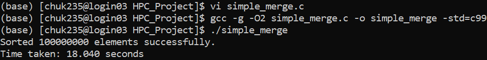
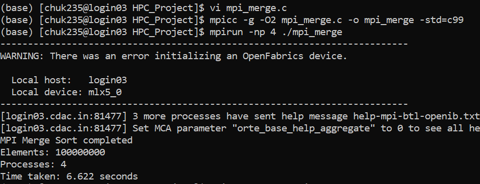
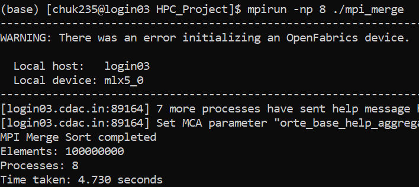
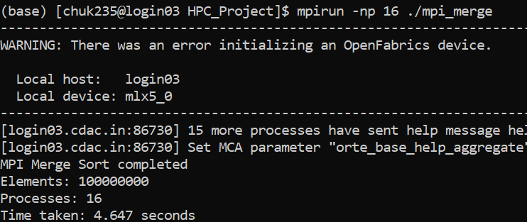
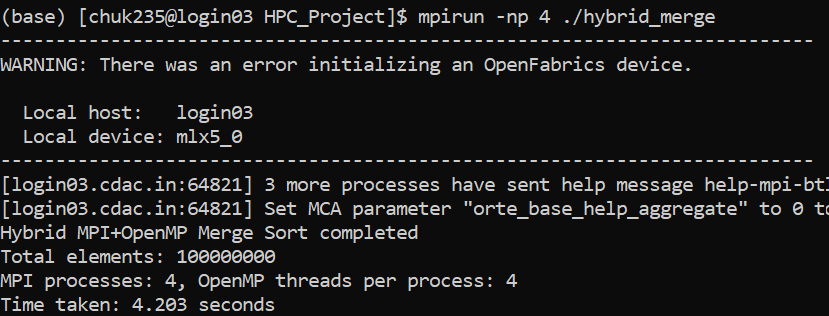
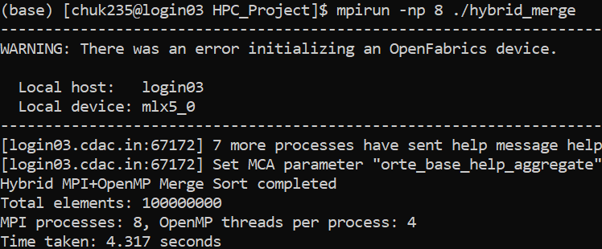
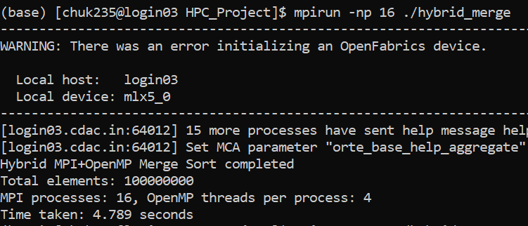
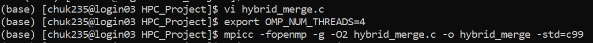

## Distributed Merge Sort with Hybrid (MPI + OpenMP)

This project implements and analyzes **merge sort** in three variants:

- **Sequential merge sort** (baseline, single core)
- **Distributed MPI merge sort** (data distributed across processes)
- **Hybrid MPI + OpenMP merge sort** (MPI between nodes + OpenMP tasks within each process)

All three versions sort the same global problem size, defined as a compile-time constant \(N\) in the source files (default `N = 100000000`).

---

## Project Structure

- **`Sequential.c`**: Single-process merge sort using `clock()` for timing.
- **`MPI.c`**: Pure MPI merge sort.
  - Rank 0 allocates and initializes the global array with random integers.
  - The array is scattered across processes, each process sorts its local chunk, and rank 0 performs a final k‑way merge using `finalMerge`.
- **`Hybrid.c`**: Hybrid MPI + OpenMP merge sort.
  - Same data distribution pattern as `MPI.c`.
  - Each process sorts its local chunk using **OpenMP tasks** (`mergeSort(..., depth)` with `#pragma omp task` up to `MAX_TASK_DEPTH`).
  - Rank 0 performs the final global merge and reports the total runtime.
- **`img/`**: PNG images of performance/scale plots:
  - `simple.png`, `mpi4.png`, `mpi8.png`, `mpi16.png`
  - `hybrid4.png`, `hybrid8.png`, `hybrid16.png`, `hybrid.png`

---

## Dependencies

To build and run the codes, you need:

- **C compiler with OpenMP support** (e.g., `gcc`, `clang`, or MSVC with OpenMP enabled)
- **MPI implementation** (e.g., MPICH, OpenMPI, or MS-MPI)
- **Make sure `mpicc`** (or equivalent MPI compiler wrapper) is available on your `PATH`.

On Windows, the easiest way is typically:

- Use **WSL** with a Linux distribution, then install `build-essential`, `mpich` or `openmpi`, and compile with `gcc`/`mpicc`.

---

## Building

You can compile each implementation separately. Example commands (GCC + MPICH/OpenMPI style):

- **Sequential version**

```bash
gcc -O3 Sequential.c -o sequential
```

- **MPI version**

```bash
mpicc -O3 MPI.c -o mpi_mergesort
```

- **Hybrid MPI + OpenMP version**

```bash
mpicc -O3 -fopenmp Hybrid.c -o hybrid_mergesort
```

If your MPI wrapper does not accept `-fopenmp`, you can compile and link manually with your C compiler and MPI libraries instead.

---

## Running

All programs generate their own random input data internally (using `rand()` seeded with `time(NULL)`).

- **Sequential**

```bash
./sequential
```

- **MPI only**

```bash
mpirun -np <num_processes> ./mpi_mergesort
```

- **Hybrid MPI + OpenMP**

```bash
export OMP_NUM_THREADS=<threads_per_process>   # Linux/WSL/bash
mpirun -np <num_processes> ./hybrid_mergesort
```

On Windows PowerShell (for a native MPI+OpenMP toolchain) you can set:

```powershell
$env:OMP_NUM_THREADS = "<threads_per_process>"
mpirun -np <num_processes> hybrid_mergesort.exe
```

The hybrid version will print:

- Total elements `N`
- Number of MPI processes
- Number of OpenMP threads per process
- Total execution time (seconds)

---

## Algorithm & Parallelization Overview

- **Merge Sort**:
  - Standard recursive divide-and-conquer algorithm splitting the array into halves, sorting each half, and merging.
- **MPI parallelization** (`MPI.c`, `Hybrid.c`):
  - Rank 0 initializes a global array of size `N`.
  - `MPI_Scatter` distributes equal-size chunks to all processes.
  - Each process sorts its local chunk.
  - Rank 0 uses iterative `finalMerge` calls to merge sorted chunks into a globally sorted array.
- **OpenMP parallelization** (`Hybrid.c`):
  - Within each process, `mergeSort` uses **OpenMP tasks** down to a maximum recursion depth (`MAX_TASK_DEPTH`).
  - A `#pragma omp single` region creates tasks, and `#pragma omp taskwait` ensures local completion before merging.

---

## Configuration

- **Problem size**:
  - Set by `#define N 100000000` at the top of `Sequential.c`, `MPI.c`, and `Hybrid.c`.
  - You can decrease `N` to reduce runtime or memory footprint for testing.
- **Task depth for OpenMP**:
  - Set by `#define MAX_TASK_DEPTH 4` in `Hybrid.c`.
  - Increasing this may create more tasks (and overhead); decreasing reduces task parallelism.

---

## Performance Analysis

- Use the reported runtimes to compare:
  - **Sequential vs MPI**: parallel speedup from distributed memory.
  - **MPI vs Hybrid**: additional benefit of intra-node threading.
- The plots in `img/` visualize:
  - Runtime and/or speedup versus number of MPI processes.
  - Comparison between pure MPI and hybrid MPI+OpenMP configurations (4, 8, 16 processes/threads, depending on the plot).

---

### Performance Plots

#### Baseline Comparison



#### MPI Performance (4 Processes)



#### MPI Performance (8 Processes)



#### MPI Performance (16 Processes)



#### Hybrid MPI + OpenMP Performance (4x4)



#### Hybrid MPI + OpenMP Performance (8x4)



#### Hybrid MPI + OpenMP Performance (16x4)



#### Hybrid Overview



You can extend this project by experimenting with different values of `N`, process counts, thread counts, and task depth, then updating or regenerating the plots.
